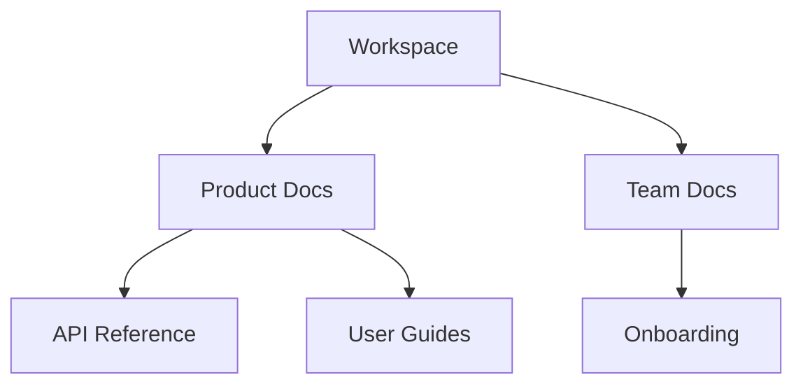

## Overview

AI Drone empowers you to create, organize, and collaborate on documentation projects with intelligent tools. You streamline workflows using AI-assisted generation, structured organization, team collaboration, version control, and powerful search features. These capabilities make managing technical docs efficient and scalable.

## Key Features

Discover the core capabilities through these highlighted features:

<Columns cols={3}>
  <Card title="AI-Assisted Generation" icon="zap" href="#ai-generation">
    Generate and edit content instantly with AI suggestions tailored to your project.
  </Card>
  <Card title="Project Organization" icon="folder" href="#organization">
    Structure your docs with intuitive folders and hierarchies.
  </Card>
  <Card title="Team Collaboration" icon="users" href="#collaboration">
    Work together in real-time with comments and approvals.
  </Card>
  <Card title="Version Control" icon="git-branch" href="#version-control">
    Track changes and revert with built-in Git integration.
  </Card>
  <Card title="Search and Tagging" icon="search" href="#search-tagging">
    Find content quickly using advanced search and custom tags.
  </Card>
</Columns>

## AI-Assisted Content Generation and Editing

Leverage AI to draft sections, summarize content, or refine wording. You select a topic, provide context, and AI Drone generates Markdown-ready text.

<Tabs>
  <Tab title="Generate New Content" icon="plus">
    Start by typing a prompt like "Explain API authentication".

    <Steps>
      <Step title="Prompt AI" icon="sparkles">
        Open the AI panel and enter your request.
      </Step>
      <Step title="Review Output" icon="edit-3">
        Edit the generated Markdown directly.
      </Step>
      <Step title="Insert" icon="file-plus">
        Insert into your document with one click.
      </Step>
    </Steps>
  </Tab>
  <Tab title="Inline Editing" icon="highlighter">
    Highlight text and use AI to improve it.

````jsx
// Before AI edit
<p>Users login with username/password.</p>

// After AI suggestion
<p>Users authenticate securely using username and password via OAuth 2.0.</p>
````
  </Tab>
</Tabs>

<Callout kind="tip">
  Use specific prompts like "Make this more technical" for better results.
</Callout>

## Project Organization and Folder Structures

You organize docs into nested folders, mimicking your codebase structure. Create workspaces for products, versions, or teams.



Use drag-and-drop to reorder. Folders support custom icons and descriptions.

## Collaboration Tools for Teams

Invite team members with role-based access. You review changes, add comments, and resolve discussions inline.

<CodeGroup tabs="Invite,Review">
```javascript
// Invite via API
const response = await fetch('https://api.example.com/workspaces/invite', {
  method: 'POST',
  body: JSON.stringify({ email: 'team@company.com', role: 'editor' })
});
```

```bash
# CLI invite
aidrone workspace invite --email team@company.com --role editor
```
</CodeGroup>

## Version Control for Documents

AI Drone integrates with Git. You commit changes, create branches, and merge pull requests directly in the editor.

<Expandable title="Advanced Git Workflow" default-open="false">
  Branch per feature, preview merges, and auto-resolve conflicts.

  | Action | Command |
  |--------|---------|
  | Create branch | `aidrone branch new feature-login` |
  | Commit | `aidrone commit -m "Add auth docs"` |
  | Merge | `aidrone merge main` |
</Expandable>

## Search and Tagging Functionalities

Tag pages with labels like `api`, `beta`, or `internal`. Full-text search indexes content, tags, and metadata.

<Callout kind="info">
  Combine tags for precise filtering, e.g., `api & beta`.
</Callout>

You access search via `Ctrl+K` or the top bar. Results show previews and tag badges for quick navigation.